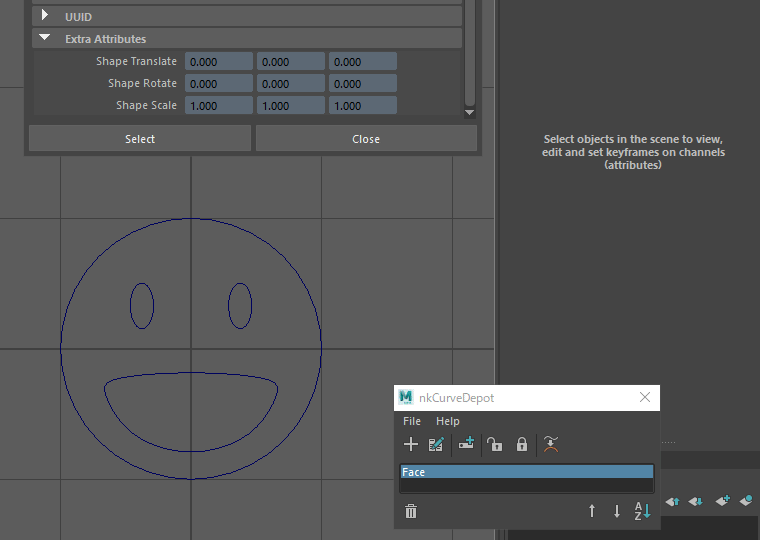

# nkCurveDepot

[](https://github.com/imaoki/nkCurveDepot/releases/latest)

カスタムカーブを定義、作成するMELツール。

## 特徴

* 任意の数のカーブを単一のカーブノードとして定義

* カーブシェイプのローカル変換を専用のTRS値で編集可能

* 既存のノード（カーブ、ロケータ、ポリゴン等々）を編集機能付きカーブに置き換え可能

## 開発環境

Maya 2022.5 / Windows 10

## インストール

01. `nkCurveDepot.mel`および`nkCurveDepotCurves`ディレクトリ（任意）をスクリプトディレクトリにコピー

    | バージョン | ディレクトリ                             |
    | ---------- | ---------------------------------------- |
    | 英語版     | `%MAYA_APP_DIR%\<version>\scripts`       |
    | 日本語版   | `%MAYA_APP_DIR%\<version>\ja_JP\scripts` |

02. Mayaを再起動

## 起動方法

```mel
nkCurveDepot;
```

## メインウィンドウ


| ボタン                                                                                                                                                                                        | 機能                                 |
| --------------------------------------------------------------------------------------------------------------------------------------------------------------------------------------------- | ------------------------------------ |
|                                                                                                                                                | カーブ定義を追加                     |
|                                                                                                                             | カーブ定義をリネーム                 |
|                                                                                                                                        | カーブノードをシーンに作成           |
|                                                                                                                 | カーブシェイプのローカル変換を有効化 |
|                                                                                                                       | カーブシェイプのローカル変換を無効化 |
|                                                                                                                                      | 既存のノードのシェイプを置き換える   |
|                                                                                                                                       | カーブ定義を削除する                 |
|  | カーブ定義を並べ替える               |

## カーブ定義の追加とカーブノードの作成


01. 追加したいカーブを選択する。（複数可）

02. ボタンでカーブ定義を追加。

03. リストに追加されたカーブ定義を選択してボタンでカーブノードを作成。

    カーブ定義をダブルクリックでも作成できます。

### 注意点

* 処理の都合上、元のカーブノードのヒストリは削除されます。

## カーブシェイプのローカル変換



01. カーブノードを選択してボタンでアトリビュートのロックを解除。

02. チャンネルボックスまたはアトリビュートエディタで`Shape Translate/Rotate/Scale`の値を編集。

03. ボタンでアトリビュートをロック。

### 注意点

* 編集は本ツールで作成したカーブノードに限ります。

* 編集後はロックすることをおすすめします。

  カーブの複雑さによっては大量の計算ノードが作成されるためです。

## 既存のノードを置き換える


01. 置き換え元のカーブノード（本ツールで作成）を選択。

02. 置き換え対象のノード（任意の種類のノード、または本ツールで作成したカーブノード）を選択。

03. ボタンで置き換え。

04. 実行後にピボットのオフセットが反映されていない場合は/ボタンを使用して更新してください。

### 注意点

* 置き換え対象ノードの元のシェイプは削除されますので適宜バックアップしてください。

## 補足事項

* ボタンで削除したカーブ定義は`nkCurveDepotCurves/trash`ディレクトリに上書き移動されます。

  残しておきたいカーブ定義は適宜`.curvedepot`ファイルをバックアップしてください。

## API

### `nkCurveDepot.CreateCurve`

カーブ名からカーブノードを作成する。

```mel
nkCurveDepot.CreateCurve(string $curveName)
```

#### パラメータ

| パラメータ   | 型       | 説明       |
| ------------ | -------- | ---------- |
| `$curveName` | `string` | カーブ名。 |

#### 戻り値

| 型       | 説明                                     |
| -------- | ---------------------------------------- |
| `string` | 作成したカーブのトランスフォームノード。 |

### `nkCurveDepot.LockCurve`

選択したカーブノードのロック状態を切り替える。

```mel
nkCurveDepot.LockCurve(string $nodes[], int $state)
```

#### パラメータ

| パラメータ | 型         | 説明           |
| ---------- | ---------- | -------------- |
| `$nodes`   | `string[]` | ノードの配列。 |
| `$state`   | `int`      | ロック状態。   |

#### 戻り値

無し。

### `nkCurveDepot.ReplaceCurves`

ターゲットノードのシェイプをカーブノードのシェイプに置き換える。

```mel
nkCurveDepot.ReplaceCurves(string $nodes[])
```

#### パラメータ

| パラメータ | 型          | 説明                                                         |
| ---------- | ----------- | ------------------------------------------------------------ |
| `$nodes`   | `string[2]` | 1番目要素がソースノード、2番目要素がターゲットノードの配列。 |

#### 戻り値

| 型         | 説明                                       |
| ---------- | ------------------------------------------ |
| `string[]` | 新たに置き換えられたシェイプノードの配列。 |

## ToDo

* カーブ定義の別名保存とインポート

* カーブ定義のカテゴリ分け
