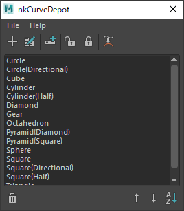

# nkRigController

[](https://github.com/imaoki/nkRigController/releases/latest)

リグ用コントローラを作成するツール。

## 特徴



* 複数のカーブを合成して単一ノードとして作成するためのコードを生成可能。

* カーブのローカル変換を専用のTRS値で編集可能。

  

  * 編集が完了したカーブはロックすることで編集用の計算ノードを除去できます。

    

  * 編集モードへはいつでも切り替えが可能。

## 開発環境

Maya 2022.5 / Windows 10

## インストール

01. `nkRigController.mel`をスクリプトディレクトリにコピー

    | バージョン | ディレクトリ                             |
    | ---------- | ---------------------------------------- |
    | 英語版     | `%MAYA_APP_DIR%\<version>\scripts`       |
    | 日本語版   | `%MAYA_APP_DIR%\<version>\ja_JP\scripts` |

02. Mayaを再起動

## 起動方法

```mel
nkRigController;
```

## ToDo

* カスタムカーブを登録する機能の実装。
